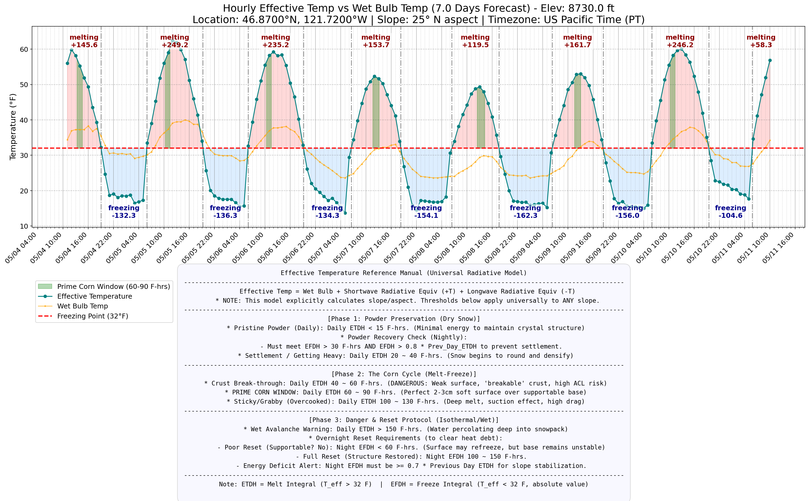
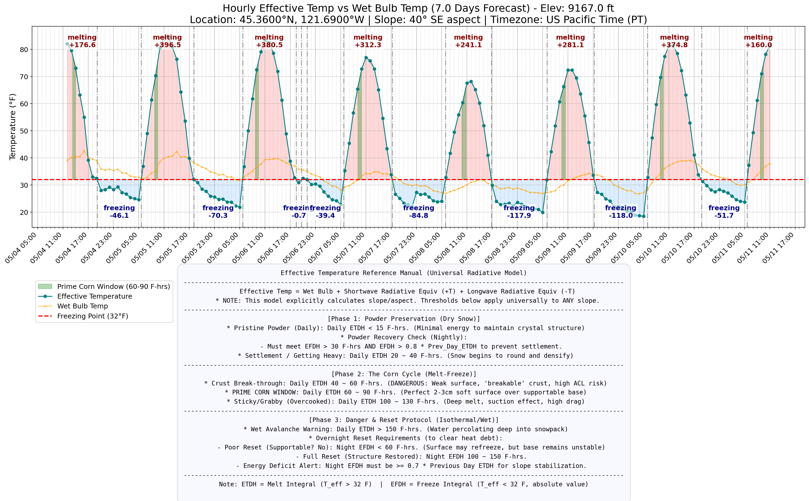

# Ullr's Secret

Calculates altitude-adjusted wet bulb temperature from weather forecast data for backcountry ski conditions assessment.

Ask AI this question to start with: What is Wet Bulb Temprature, and what it means for powder preservation & corn formation.

Core calculation references: [English](core_calc_en.pdf) | [中文](core_calc_cn.pdf)

## Limitations & Known Variances (模型局限性与已知偏差)

The Universal Radiative Model utilizes an Effective Temperature ($T_{eff}$) integral (ETDH/EFDH) to estimate snow phase transitions. **The model is highly accurate for its ideal baseline environment: wide-open, high-alpine bowls with clean snow (开阔、平坦、无遮挡且雪质干净的高海拔大坡).** In these ideal zones, solar radiation is uninterrupted and albedo is predictable. However, when moving away from these ideal conditions, the framework has inherent physical and environmental limitations that users must manually account for in the field.

### 1. Thermodynamic & Structural Blindspots (热力学与结构局限)
* **The Linearity Fallacy (线性累加谬误):** The degree-hour integral treats time and temperature linearly. It cannot distinguish between prolonged, low-intensity warmth (which allows snow to settle without structural collapse) and brief, high-intensity radiation (Flash Melt) that rapidly destroys the snow crystal matrix.
* **1D Surface vs. 3D Volume (一维表面与三维深度的脱节):** The model calculates surface energy but ignores the insulating properties of the snowpack depth. A high night EFDH might trigger a "Full Reset" alert, while in reality, it only forms a dangerous 3-5cm "Breakable Crust" over deeply saturated, unstable wet snow. 
* **Latent Heat & Isothermal Saturation (潜热盲区):** Physical snow temperature is locked at $0^\circ\text{C}$ ($32^\circ\text{F}$). Once the snowpack reaches its maximum Liquid Water Content (LWC), further ETDH accumulation translates to water runoff rather than softer snow. 
* **Sub-surface Heat Flux (底层热传导):** In late spring, deep, isothermal snowpacks act as a thermal reservoir, pumping latent heat upward and significantly delaying the expected EFDH refreeze. Conversely, cold mid-winter base layers can accelerate surface freezing.

### 2. Microclimate & Topographic Variances (微气候与地形偏差)
* **Horizon Masking in Complex Terrain (复杂地形的地形遮挡):** Unlike the ideal open bowls, complex terrain (e.g., narrow couloirs, deep valleys, or old-growth forests) creates physical horizon masking. This cuts off shortwave radiation hours before actual sunset, triggering a premature and rapid refreeze (Reverse Corn) long before the model predicts.
* **Albedo Degradation / "Dirty Snow" (反照率衰减/脏雪效应):** The model's baseline assumes clean snow. Late-season "dirty snow" (dust, pollen, tree debris) significantly lowers surface albedo, absorbing exponentially more shortwave radiation and creating a larger heat debt than the model accounts for.
* **Wind-Driven Convection (风驱对流):** Strong wind events strip the surface boundary layer. Cold winds will drastically amplify the evaporative cooling (Wet Bulb) effect, drying and freezing the surface faster than EFDH predicts. Warm, dry downslope winds will pump sensible heat into the snow, counteracting night-time radiative cooling.

### 3. Off-Piste vs. On-Piste Variances (道外与道内雪况差异)
* **Mechanical Compaction (机械压实):** Grooming machines heavily compress the snow, destroying natural capillary structures. Groomed pistes (道内) have significantly higher density and thermal conductivity than off-piste (道外) snow, meaning they retain cold longer in the morning but can turn into a dense, sticky slush faster once the structural threshold is breached.
* **Artificial Snow Composition (人造雪晶体):** On-piste environments often contain artificial snow, which consists of spherical ice pellets rather than natural dendritic crystals. This results in different baseline densities and moisture retention rates, altering the precise ETDH/EFDH thresholds needed for the Corn Cycle.
* **Skier Traffic Impact (滑行切割效应):** High-traffic on-piste areas expose deeper snow layers mechanically. The constant churning accelerates the melting process during ETDH phases and creates unpredictable, rutted "coral reef" surfaces during the EFDH refreeze phase, unlike the uniform crusts found off-piste.

## Prerequisite

py3.10+ (only tested in py3.10)

## Install

Use make target `make install` will install the CLI in a venv, then
```bash
venv/bin/activate
```

## Usage

```
$ ullrs-secret --help
Usage: ullrs-secret [OPTIONS] COMMAND [ARGS]...

  Ullr's Secret — backcountry ski snow conditions forecaster.

Options:
  --help  Show this message and exit.

Commands:
  consolidation-plot  Compute melt-freeze consolidation model and plot...
  plot                Read standard JSON, compute effective temps,...
  import              Import weather data from a source into standard JSON.
```

### Import weather data

```
$ ullrs-secret import --help
Usage: ullrs-secret import [OPTIONS] COMMAND [ARGS]...

  Import weather data from a source into standard JSON.

Options:
  --help  Show this message and exit.

Commands:
  nws  Fetch and parse NWS weather data from a URL or local XML file path.
```

```
$ ullrs-secret import nws --help
Usage: ullrs-secret import nws [OPTIONS] SOURCE

  Fetch and parse NWS weather data from a URL or local XML file path.

Options:
  -o, --output TEXT  Output JSON path.
  --help             Show this message and exit.
```

```
# Weather data of Newton Clark Glacier of Mt Hood
$ ullrs-secret import nws "https://forecast.weather.gov/MapClick.php?lat=45.3668&lon=-121.6867&FcstType=digitalDWML"
Wrote 168 observations to weather_data.json
```

### Effective temperature forecast (primary command)

The main output of this tool. Computes Total Effective Temperature — the actual thermal energy hitting the snow surface — by combining wet bulb temperature with shortwave (solar) and longwave (atmospheric) radiative fluxes. This is the temperature the snowpack "feels," not what the thermometer reads.

```
$ ullrs-secret plot --help
Usage: ullrs-secret plot [OPTIONS] FILE

  Read standard JSON, compute effective temps, generate chart and CSV.

Options:
  --days FLOAT       Number of forecast days.
  --slope FLOAT      Slope angle in degrees (0 = flat).
  --aspect FLOAT     Slope aspect in degrees (0=N, 90=E, 180=S, 270=W).
  --elevation FLOAT  Target elevation in ft (adjusts from data source elevation).
  --help             Show this message and exit.
```

```
# Flat terrain (default) — good baseline for open bowls
$ ullrs-secret plot --days 4.5 weather_data.json
Working Elevation: 9167.0 ft. Local pressure: 719.64 hPa
Chart saved to: effective_temp_chart.png
Data saved to: effective_temp_data.csv

# Southeast-facing 35° slope — typical steep corn line
$ ullrs-secret plot --days 4.5 --slope 35 --aspect 135 weather_data.json
Working Elevation: 9167.0 ft. Local pressure: 719.64 hPa
Chart saved to: effective_temp_chart.png
Data saved to: effective_temp_data.csv

# Adjust forecast to a higher elevation (data source at 9167 ft, target at 10500 ft)
$ ullrs-secret plot --days 4.5 --elevation 10500 weather_data.json
Data adjusted from 9167.0 ft to target elevation: 10500.0 ft.
Working Elevation: 10500.0 ft. Local pressure: 690.38 hPa
Chart saved to: effective_temp_chart.png
Data saved to: effective_temp_data.csv
```

The chart plots effective temperature as the primary curve with wet bulb as overlay, annotates each melt/freeze segment with its integral (F-hrs), and highlights the Prime Corn Window (60–90 F-hrs cumulative melt) in green. A built-in reference manual below the chart maps integral values to snow conditions:

| Effective Melt Integral (ETDH) | Snow State |
|-------------------------------|------------|
| < 15 F-hrs | Pristine powder preserved |
| 20–40 F-hrs | Settlement, getting heavy |
| 40–60 F-hrs | Crust break-through (dangerous, high ACL risk) |
| **60–90 F-hrs** | **Prime corn window** |
| 100–130 F-hrs | Sticky/grabby, overcooked |
| > 150 F-hrs | Wet avalanche warning |

Overnight refreeze (EFDH) must reach at least 0.7× the previous day's melt integral for slope stabilization. Full structural reset requires 100–150 F-hrs of freeze.

**Slope & aspect matter.** A 35° south-facing slope receives dramatically more solar energy than a flat surface or north-facing slope at the same elevation. Always match `--slope` and `--aspect` to the line you intend to ski — the corn window timing can shift by hours between aspects.

**Elevation adjustment.** Weather data sources report from a fixed station elevation. Use `--elevation` to project the forecast to a different elevation. The adjustment applies standard atmospheric lapse rates (3.56°F/1000ft for air temperature, 1.0°F/1000ft for dew point) and recalculates relative humidity from the adjusted values. This is useful when the nearest data point is significantly above or below your target line — e.g., using a summit station forecast for a mid-mountain chute.

Example outputs:




### Consolidation model (melt-freeze structural analysis)

```
$ ullrs-secret consolidation-plot --help
Usage: ullrs-secret consolidation-plot [OPTIONS] FILE

  Compute melt-freeze consolidation model and plot D_total curve.

Options:
  --days FLOAT   Number of forecast days.
  --swe FLOAT    Snow water equivalent in mm.
  --depth FLOAT  Physical snow depth in cm.
  --help         Show this message and exit.
```

```
$ ullrs-secret consolidation-plot --days 4.5 --swe 40 --depth 25 weather_data.json
Elevation: 9167.0 ft. Local pressure: 719.64 hPa
Chart saved to: d_total_curve.png
Data saved to: consolidation_forecast_data.csv
```

This models how melt-freeze cycles structurally consolidate new snow into a supportable corn base. Snow density is derived from SWE and physical depth, which drives dynamic heat transfer and percolation coefficients. The chart tracks cumulative consolidated depth (D_total) and marks when it crosses the support threshold — the point where the base locks in and steep lines become viable. Degradation penalties apply for insufficient overnight refreezes and isothermal overheating.

**TODO:** This plot currently uses wet bulb temperature for its melt/freeze cycle detection. It needs to be updated to use effective temperature (incorporating shortwave and longwave radiation data) for consistency with the radiative model.

## Output

- `effective_temp_chart.png` — effective temperature forecast with melt/freeze integrals and corn window (from `plot`)
- `effective_temp_data.csv` — hourly data export with wet bulb and effective temp columns
- `d_total_curve.png` — consolidation model chart (from `consolidation-plot`)
- `consolidation_forecast_data.csv` — consolidation model data export

## Standard Weather Data Format

All importers produce the same JSON format. This is the contract between data sources and the plotting/calculation engine:

```json
{
  "source": "nws",
  "latitude": 45.3668,
  "longitude": -121.6867,
  "elevation_ft": 9167.0,
  "observations": [
    {
      "time_iso": "2026-04-29T21:00:00-07:00",
      "air_temp_f": 26.0,
      "relative_humidity_pct": 54.0,
      "dew_point_f": 12.0,
      "cloud_cover_pct": 40.0
    }
  ]
}
```

| Field | Description |
|-------|-------------|
| `source` | Importer name (for provenance tracking) |
| `latitude` | Station latitude in decimal degrees. Can be `null` if unavailable. |
| `longitude` | Station longitude in decimal degrees. Can be `null` if unavailable. |
| `elevation_ft` | Station elevation in feet above sea level. Used to calculate local atmospheric pressure, which affects the psychrometric wet bulb equation. |
| `observations[].time_iso` | ISO-8601 timestamp with timezone offset. Hourly resolution is expected. |
| `observations[].air_temp_f` | Air temperature in Fahrenheit. Can be `null` if missing. |
| `observations[].relative_humidity_pct` | Relative humidity as a percentage (0-100). Can be `null` if missing. Together with air temperature, these are the two physical inputs needed to solve for wet bulb temperature. |
| `observations[].dew_point_f` | Dew point temperature in Fahrenheit. Can be `null` if missing or unavailable from the data source. |
| `observations[].cloud_cover_pct` | Total cloud cover as a percentage (0-100). Can be `null` if missing or unavailable from the data source. |

Elevation, air temperature, and relative humidity are the only physical values your data source needs to provide. Everything else (atmospheric pressure, saturation vapor pressure, wet bulb temperature) is derived. Dew point, cloud cover, and lat/long are optional supplementary fields.

## Adding a New Importer

NWS only covers US locations. If you ski in Canada, Europe, Japan, or anywhere else, you need a different weather data source. Adding an importer makes this tool work for your mountains.

To add a new data source, create a file in `ullrs_secret/importers/` (e.g., `spotwx.py`):

```python
"""SpotWx data importer."""

import click

from . import register


# Define whatever Click arguments/options your source needs.
# NWS just takes a URL, but yours might need an API key, coordinates, etc.
SPOTWX_DECORATORS = [
    click.option("--api-key", required=True, help="SpotWx API key."),
    click.option("--lat", type=float, required=True, help="Latitude."),
    click.option("--lon", type=float, required=True, help="Longitude."),
]


@register("spotwx", decorators=SPOTWX_DECORATORS)
def fetch(api_key, lat, lon):
    """Fetch weather data from SpotWx API."""
    # Your fetch logic here — must return the standard dict:
    return {
        "source": "spotwx",
        "latitude": 49.0,
        "longitude": -122.5,
        "elevation_ft": 6500.0,
        "observations": [
            {
                "time_iso": "2026-04-29T12:00:00-07:00",
                "air_temp_f": 28.0,
                "relative_humidity_pct": 72.0,
                "dew_point_f": 20.0,
                "cloud_cover_pct": 55.0,
            },
            # ...
        ],
    }
```

Then register it in `ullrs_secret/importers/__init__.py`:

```python
from . import nws  # noqa: E402, F401
from . import spotwx  # noqa: E402, F401
```

That's it. Your importer automatically appears under `ullrs-secret import spotwx`.
