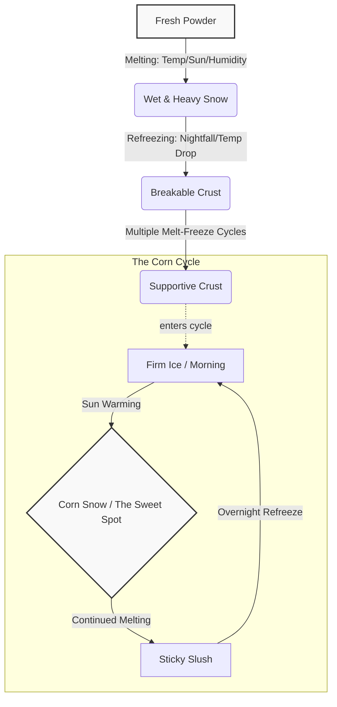
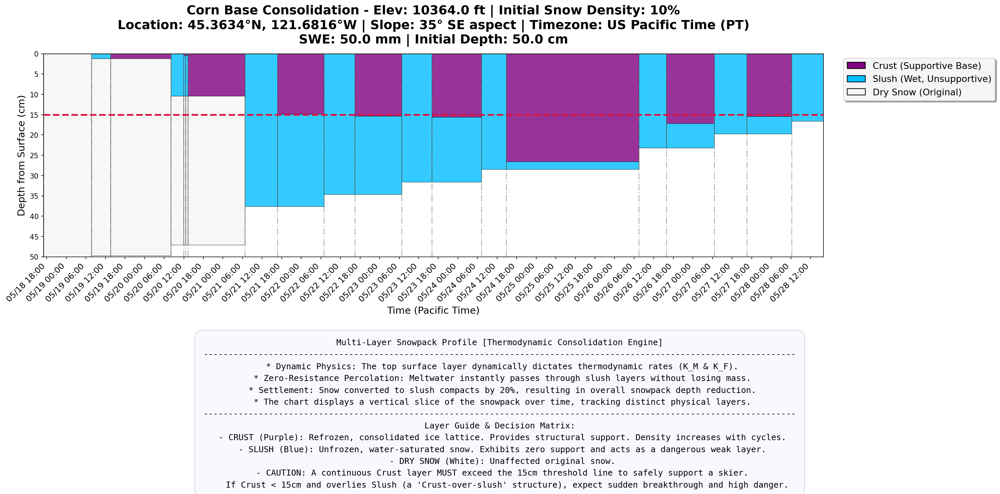

# Ullr's Secret

Use weather data to forecast snow quality for backcountry skiing.

Core calculation references: [English](core_calc_en.pdf) | [中文](core_calc_cn.pdf)

## Motivation and Background

In backcountry skiing, the quality of your descent is almost entirely dictated by the condition of the snow. However, snow is a highly dynamic medium. After a fresh storm, the snowpack undergoes a complex, continuous physical transformation driven by temperature, humidity, and solar radiation. 

Understanding and predicting these transitions is the holy grail for backcountry skiers seeking the best possible downhill experience.

### The Lifecycle of Snow
To understand the problem `ullrs-secret` solves, we first need to look at the typical state machine of snow conditions following a fresh snowfall:



1. **Fresh Powder:** Immediately after a storm, the snow is typically dry, light, and offers an effortless, euphoric skiing experience.
2. **Wet & Heavy Snow:** As the sun rises and temperatures or humidity increase, the delicate structure of the powder crystals breaks down. The snow begins to melt, becoming heavy, dense, and physically demanding to ski through due to increased friction.
3. **The Breakable Crust:** When night falls or temperatures drop, this melted, heavy snow refreezes. Initially, this creates a thin ice shell over soft snow. This is the notorious **"breakable crust"**—a highly unpredictable and frustrating surface that cannot fully support a skier's weight.
4. **The Supportive Crust:** If the snowpack undergoes enough of these melt-freeze cycles over several days, the icy crust eventually thickens and consolidates enough to support the weight of a skier without breaking.
5. **The Corn Cycle:** Once a supportive crust is established, the snow enters a predictable, daily spring skiing phase known as the *Corn Cycle*:
   - *Morning:* The surface is a hard, firm sheet of ice.
   - *The Sweet Spot (Corn):* As the sun warms the surface, the top inch or two melts just enough to create a smooth, forgiving, and incredibly fun surface known as "corn snow." 
   - *Slush:* If the snow continues to melt past the sweet spot, it becomes sticky, grabby slush that acts like glue on ski bases.

### Enter `ullrs-secret`
Backcountry skiers spend hours agonizing over weather forecasts trying to guess exactly where the snow is in this lifecycle. `ullrs-secret` is designed to take the guesswork out of ski touring by programmatically collecting and analyzing meteorological data to answer three critical questions:

* **Powder Preservation:** How long will the freshly fallen snow remain dry and light before it degrades?
* **Crust Consolidation:** How much time and how many melt-freeze cycles will it take for the current fresh snow to evolve past the breakable crust phase and become a supportive base?
* **Corn O'Clock Prediction:** During the spring corn cycle, what is the precise time window—down to the hour—when the snow will be perfectly softened for a specific aspect and elevation?

### Why It Matters
By providing data-driven predictions for these transitions, `ullrs-secret` empowers backcountry skiers to meticulously plan their tours. Users can determine exactly *which day* to go, *where* to route find based on solar aspects, and *what time* to drop in. The ultimate goal? Spending less time skiing survival snow, and maximizing your chances of scoring perfect powder and perfectly timed corn.

### Real-World Example
Curious how this looks in practice? Check out our detailed walkthrough: **[Chasing the Perfect Corn: A Weekend Backcountry Saga with Ullr's Secret](example/arrange-weekend-bc-destination-n-timeline.md)**.

## Limitations & Known Variances (模型局限性与已知偏差)

The Universal Radiative Model utilizes an Effective Temperature ($T_{eff}$) integral (ETDH/EFDH) to estimate snow phase transitions. **The model is highly accurate for its ideal baseline environment: wide-open, high-alpine bowls with clean snow (开阔、平坦、无遮挡且雪质干净的高海拔大坡).** In these ideal zones, solar radiation is uninterrupted and albedo is predictable. However, when moving away from these ideal conditions, the framework has inherent physical and environmental limitations that users must manually account for in the field.

### 1. Thermodynamic & Structural Blindspots (热力学与结构局限)
* **The Linearity Fallacy (线性累加谬误):** The degree-hour integral treats time and temperature linearly. It cannot distinguish between prolonged, low-intensity warmth (which allows snow to settle without structural collapse) and brief, high-intensity radiation (Flash Melt) that rapidly destroys the snow crystal matrix.
* **1D Surface vs. 3D Volume (一维表面与三维深度的脱节):** The model calculates surface energy but ignores the insulating properties of the snowpack depth. A high night EFDH might trigger a "Full Reset" alert, while in reality, it only forms a dangerous 3-5cm "Breakable Crust" over deeply saturated, unstable wet snow. 
* **Latent Heat & Isothermal Saturation (潜热盲区):** Physical snow temperature is locked at $0^\circ\text{C}$ ($32^\circ\text{F}$). Once the snowpack reaches its maximum Liquid Water Content (LWC), further ETDH accumulation translates to water runoff rather than softer snow. 
* **Sub-surface Heat Flux (底层热传导):** In late spring, deep, isothermal snowpacks act as a thermal reservoir, pumping latent heat upward and significantly delaying the expected EFDH refreeze. Conversely, cold mid-winter base layers can accelerate surface freezing.

### 2. Microclimate & Topographic Variances (微气候与地形偏差)
* **Horizon Masking in Complex Terrain (复杂地形的地形遮挡):** Unlike the ideal open bowls, complex terrain (e.g., narrow couloirs, deep valleys, or old-growth forests) creates physical horizon masking. This cuts off shortwave radiation hours before actual sunset, triggering a premature and rapid refreeze (Reverse Corn) long before the model predicts.
* **Albedo Degradation / "Dirty Snow" (反照率衰减/脏雪效应):** The model's baseline assumes clean snow. Late-season "dirty snow" (dust, pollen, tree debris) significantly lowers surface albedo, absorbing exponentially more shortwave radiation and creating a larger heat debt than the model accounts for.
* **Wind-Driven Convection (风驱对流):** Strong wind events strip the surface boundary layer. Cold winds will drastically amplify the evaporative cooling (Wet Bulb) effect, drying and freezing the surface faster than EFDH predicts. Warm, dry downslope winds will pump sensible heat into the snow, counteracting night-time radiative cooling.

### 3. Off-Piste vs. On-Piste Variances (道外与道内雪况差异)
* **Mechanical Compaction (机械压实):** Grooming machines heavily compress the snow, destroying natural capillary structures. Groomed pistes (道内) have significantly higher density and thermal conductivity than off-piste (道外) snow, meaning they retain cold longer in the morning but can turn into a dense, sticky slush faster once the structural threshold is breached.
* **Artificial Snow Composition (人造雪晶体):** On-piste environments often contain artificial snow, which consists of spherical ice pellets rather than natural dendritic crystals. This results in different baseline densities and moisture retention rates, altering the precise ETDH/EFDH thresholds needed for the Corn Cycle.
* **Skier Traffic Impact (滑行切割效应):** High-traffic on-piste areas expose deeper snow layers mechanically. The constant churning accelerates the melting process during ETDH phases and creates unpredictable, rutted "coral reef" surfaces during the EFDH refreeze phase, unlike the uniform crusts found off-piste.

## Prerequisite

py3.10+ (only tested in py3.10)

## Install

Use make target `make install` will install the CLI in a venv, then
```bash
venv/bin/activate
```

## Usage

```
$ ullrs-secret --help
Usage: ullrs-secret [OPTIONS] COMMAND [ARGS]...

  Ullr's Secret — backcountry ski snow conditions forecaster.

Options:
  --help  Show this message and exit.

Commands:
  consolidation-plot  Compute melt-freeze consolidation model and plot...
  import              Import weather data from a source into standard JSON.
  plot                Read standard JSON, compute effective temps,...
  snotel              Fetch nearest SNOTEL station data and infer snow...
  terrain             Calculate elevation, slope, and aspect for a...
```

### Terrain calculations

The `terrain` command calculates the elevation, slope, and aspect for a specific geographic coordinate.

* **Data Source:** [Open Topo Data API](https://www.opentopodata.org/) using the SRTM30M dataset (Shuttle Radar Topography Mission, ~30-meter resolution).
* **Limitations:** The 30m resolution smooths over micro-terrain. A narrow couloir or small cliff band will not be accurately represented in the calculated slope angle. Use this for general aspect/elevation targeting, not micro-route finding.

```
$ ullrs-secret terrain --help
Usage: ullrs-secret terrain [OPTIONS]

  Calculate elevation, slope, and aspect for a coordinate.

Options:
  --lat FLOAT  Latitude of the location (+ for North, - for South)  [required]
  --lon FLOAT  Longitude of the location (+ for East, - for West)  [required]
  --help       Show this message and exit.
```

Example:
```
$ ullrs-secret terrain --lat 46.8523 --lon -121.7603
Coordinates: 46.85230, -121.76030
Elevation:   9167.0 ft (2794.1 m)
Slope:       28°
Aspect:      135° SE
```

### SNOTEL data and snow inference

Fetching SNOTEL data is a two-step process: first, list nearby stations, and then query the desired station for snow data.

* **Data Source:** [USDA NRCS AWDB API](https://wcc.sc.egov.usda.gov/awdbRestApi/swagger-ui/index.html) pulling directly from the SNOTEL (Snow Telemetry) network.
* **Limitations:** SNOTEL stations are only available in the Western United States and Alaska. Inference logic applies a very simple base assumption (+10% depth per 1000 ft gained) which does not account for wind loading, localized orographic effects, or significant rain-shadows. It is a rough heuristic, not a guarantee.

#### 1. Find nearby stations

Use the `snotel-list` command to find the 5 nearest SNOTEL stations to your coordinates. This allows you to choose a higher-elevation station if the closest one has already melted out.

```
$ ullrs-secret snotel-list --help
Usage: ullrs-secret snotel-list [OPTIONS]

  List the 5 nearest SNOTEL stations to a given coordinate.

Options:
  --lat FLOAT  Latitude of the location (+ for North, - for South)  [required]
  --lon FLOAT  Longitude of the location (+ for East, - for West)  [required]
  --help       Show this message and exit.
```

Example:
```
$ ullrs-secret snotel-list --lat 48.48260 --lon -121.04877
Top 5 nearest SNOTEL stations to (48.48260, -121.04877):
Station Name              | Elevation  | Distance   | Direction  | Identifier
--------------------------------------------------------------------------------
Thunder Basin             | 4310 ft    | 4.1 mi     | NE         | 817:WA:SNTL
Park Creek Ridge          | 4610 ft    | 6.6 mi     | ESE        | 681:WA:SNTL
Swamp Creek               | 3930 ft    | 13.6 mi    | ENE        | 975:WA:SNTL
Rainy Pass                | 4880 ft    | 14.5 mi    | E          | 711:WA:SNTL
Lyman Lake                | 5990 ft    | 20.6 mi    | SSE        | 606:WA:SNTL

Use 'ullrs-secret snotel --site "<Identifier or Name>"' to fetch data for a specific station.
```

#### 2. Fetch snow data

The `snotel` command fetches historical Snow Depth, Snow Water Equivalent (SWE), daily snow, and daily density data for a specific station. It can also infer the expected snow depth at your target elevation.

```
$ ullrs-secret snotel --help
Usage: ullrs-secret snotel [OPTIONS]

  Fetch data for a specific SNOTEL station and infer snow depth at target elevation.

Options:
  --site TEXT        SNOTEL station name or identifier (e.g., 'Thunder
                     Basin' or '817:WA:SNTL')  [required]
  --elevation FLOAT  Target elevation in ft for snow depth inference.
  --start TEXT       Start date (YYYY-MM-DD). Defaults to 7 days ago.
  --end TEXT         End date (YYYY-MM-DD). Defaults to today.
  --help             Show this message and exit.
```

Example:
```
$ ullrs-secret snotel --site "Lyman Lake" --elevation 7000
SNOTEL Station: Lyman Lake (606:WA:SNTL)
  Elevation: 5990 ft

Data from 2026-05-07 to 2026-05-14:
Date         | Depth (cm)   | SWE (mm)     | Density      | 24h Snow (cm)   | 24h Density 
-------------------------------------------------------------------------------------
2026-05-07   | 170.2        | 759.5        | 0.45         | 0.0             | -           
2026-05-08   | 165.1        | 734.1        | 0.44         | 0.0             | -           
...
2026-05-13   | 144.8        | 629.9        | 0.44         | 5.1             | 0.00        

Snow Level Inference at 7000 ft:
  Elevation Difference: +1010 ft
  Latest SNOTEL Depth (2026-05-13): 144.8 cm
  Inferred Target Depth (approx. 10%/1000ft): 159.4 cm
```

### Import weather data

The `import` command fetches weather data from various sources (e.g., NWS, ERA5) and converts it into a standard JSON format used by the core calculation engine. 

For detailed usage on available importers, the standard JSON format, and instructions on how to build your own importer, please see the [Importers Documentation](ullrs_secret/importers/README.md).

### Effective temperature forecast (primary commands)

The main output of this tool. Computes Total Effective Temperature — the actual thermal energy hitting the snow surface — by combining wet bulb temperature with shortwave (solar) and longwave (atmospheric) radiative fluxes. This is the temperature the snowpack "feels," not what the thermometer reads.

#### Powder Preservation Forecast (`pow-plot`)

Use `pow-plot` to forecast how long fresh powder will remain dry and light before it degrades. It tracks melting heat integrals against a 15 F-hrs threshold.

```
$ ullrs-secret pow-plot --help
Usage: ullrs-secret pow-plot [OPTIONS] FILE

  Read standard JSON, compute effective temps, generate powder preservation chart and CSV.

Options:
  --start FLOAT      Start day offset (e.g. 0.0 for start of data).
  --end FLOAT        End day offset (e.g. 3.0). Defaults to end of data.
  --slope FLOAT      Slope angle in degrees (0 = flat).
  --aspect FLOAT     Slope aspect in degrees (0=N, 90=E, 180=S, 270=W).
  --elevation FLOAT  Target elevation in ft (adjusts from data source
                     elevation).
  --help             Show this message and exit.
```

```
# Check how long fresh snow will preserve on a shady north-facing 35° slope
$ ullrs-secret pow-plot --slope 35 --aspect 0 weather_data.json
Chart saved to: pow_forecast_chart.png
Data saved to: pow_forecast_data.csv
```

#### Corn Snow Forecast (`corn-plot`)

Use `corn-plot` to predict the prime corn window for spring skiing. It models melt depth, crust breakthrough thresholds, and calculates the optimal soften window based on physical snow density.

```
$ ullrs-secret corn-plot --help
Usage: ullrs-secret corn-plot [OPTIONS] FILE

  Read standard JSON, compute effective temps, generate corn snow chart and CSV.

Options:
  --start FLOAT      Start day offset (e.g. 0.0 for start of data).
  --end FLOAT        End day offset (e.g. 3.0). Defaults to end of data.
  --slope FLOAT      Slope angle in degrees (0 = flat).
  --aspect FLOAT     Slope aspect in degrees (0=N, 90=E, 180=S, 270=W).
  --elevation FLOAT  Target elevation in ft (adjusts from data source
                     elevation).
  --density FLOAT    Estimated snow density (e.g. 0.35 for typical spring
                     snow, 0.50 for firn).
  --help             Show this message and exit.
```

```
# Flat terrain (default) — good baseline for open bowls
$ ullrs-secret corn-plot --end 4.5 weather_data.json
Working Elevation: 9167.0 ft. Local pressure: 719.64 hPa
Chart saved to: corn_forecast_chart.png
Data saved to: corn_forecast_data.csv

# Southeast-facing 35° slope — typical steep corn line
$ ullrs-secret corn-plot --end 4.5 --slope 35 --aspect 135 weather_data.json
Working Elevation: 9167.0 ft. Local pressure: 719.64 hPa
Chart saved to: corn_forecast_chart.png
Data saved to: corn_forecast_data.csv

# Adjust forecast to a higher elevation (data source at 9167 ft, target at 10500 ft)
$ ullrs-secret corn-plot --end 4.5 --elevation 10500 weather_data.json
Data adjusted from 9167.0 ft to target elevation: 10500.0 ft.
Working Elevation: 10500.0 ft. Local pressure: 690.38 hPa
Chart saved to: corn_forecast_chart.png
Data saved to: corn_forecast_data.csv
```

The `corn-plot` chart plots effective temperature as the primary curve with wet bulb as overlay, annotates each melt/freeze segment with its integral (F-hrs), and highlights the Prime Corn Window in green. 

**Dynamic Corn Window:** The timing and duration of the corn window are calculated dynamically based on the estimated physical snow density (`--density`, defaults to 0.5 for high-alpine firn). Denser snow (like late-spring volcano base) requires more initial heat to overcome its overnight "cold content" but can tolerate much higher total heat before its structure collapses. For example, a density of 0.35 yields a 60–90 F-hrs window, while a density of 0.50 stretches it to 80–120 F-hrs.

A built-in reference manual below the chart maps integral values to snow conditions (baseline shown for 0.35 density):

| Effective Melt Integral (ETDH) | Snow State |
|-------------------------------|------------|
| < 15 F-hrs | Pristine powder preserved |
| 20–40 F-hrs | Settlement, getting heavy |
| 40–60 F-hrs | Crust break-through (dangerous, high ACL risk) |
| **60–90 F-hrs** | **Prime corn window** |
| 100–130 F-hrs | Sticky/grabby, overcooked |
| > 150 F-hrs | Wet avalanche warning |

Overnight reset depends on both structural and thermal checks:
- **Structural Check:** Freeze Depth MUST exceed the previous day's Melt Depth to prevent Breakable Crust.
- **Thermal Check:** Night EFDH MUST be >= 0.7× the previous day's melt integral (ETDH) to clear deep heat debt and prevent Wet Avalanches.

**Slope & aspect matter.** A 35° south-facing slope receives dramatically more solar energy than a flat surface or north-facing slope at the same elevation. Always match `--slope` and `--aspect` to the line you intend to ski — the corn window timing can shift by hours between aspects.

**Elevation adjustment.** Weather data sources report from a fixed station elevation. Use `--elevation` to project the forecast to a different elevation. The adjustment applies standard atmospheric lapse rates (3.56°F/1000ft for air temperature, 1.0°F/1000ft for dew point) and recalculates relative humidity from the adjusted values. This is useful when the nearest data point is significantly above or below your target line — e.g., using a summit station forecast for a mid-mountain chute.

Example outputs:


### Consolidation model (melt-freeze structural analysis)

```
$ ullrs-secret consolidation-plot --help
Usage: ullrs-secret consolidation-plot [OPTIONS] FILE

  Compute melt-freeze consolidation model and plot the multi-layer profile.

Options:
  --start FLOAT      Start day offset (e.g. 0.0 for start of data).
  --end FLOAT        End day offset (e.g. 3.0). Defaults to end of data.
  --swe FLOAT    Snow water equivalent in mm.
  --depth FLOAT  Physical snow depth in cm.
  --help         Show this message and exit.
```

```
$ ullrs-secret consolidation-plot --end 4.5 --swe 40 --depth 25 weather_data.json
Elevation: 9167.0 ft. Local pressure: 719.64 hPa
Chart saved to: multi-layer-profile.png
Data saved to: consolidation_forecast_data.csv
```

This models how melt-freeze cycles structurally consolidate new snow into a supportable corn base. The core physics engine is a **Dynamic Multi-Layer Finite Element Simulation**.

**Physics Engine: Dynamic Multi-Layer Tracking**
Rather than tracking a single arbitrary depth line, the engine mathematically splits the snowpack into distinct physical layers (`Crust`, `Slush`, `Dry Snow`) and dynamically calculates the thermodynamic evolution of each layer over time based on mass conservation and volume compression:

- **Layer-Specific Density & Surface Dominance:** Each layer tracks its own independent density. The speed of daytime melting and nighttime freezing is dictated entirely by the density of the *top surface layer*. As the surface consolidates into dense spring Firn, its thermal conductivity spikes, creating the classic spring effect where the surface melts and freezes extremely rapidly.
- **Zero-Resistance Slush Percolation:** When daytime heat melts the surface, it generates a specific Water Equivalent ($W_{eq}$). This liquid water percolates downward. Crucially, if it encounters an unfrozen `Slush` layer, it passes through with *zero resistance*—depositing its heat and mass directly onto the deeper, intact layers. This accurately models how a buried weak layer ("Crust-over-slush") accelerates the deterioration of the underlying snowpack.
- **Physical Settlement:** When structured snow (Dry or Crust) is melted and converted into Slush, the loss of the crystal matrix combined with the lubrication of liquid water causes immediate physical settlement. The simulation automatically compacts newly formed Slush layers by 20%, visually reducing the total depth of the snowpack on the chart.
- **Asymptotic Consolidation:** When Slush refreezes into Crust, its density jumps. Over multiple cycles, the density mathematically asymptotes toward the physical limit of spring corn snow (~0.55 g/cm³).

**Visualizing the Trap:**
The chart renders a vertical cross-section of the snowpack over time as stacked colored rectangles. A red dashed line marks the 15cm support threshold from the surface. 
This multi-layer visualization instantly reveals the most dangerous spring snowpack structure: **Multiple Weak Layers (Crust-Facet-Crust)**. If you see a thin purple `Crust` layer (< 15cm) sitting on top of a thick blue `Slush` layer, the structure cannot support a skier. Breakthrough is imminent, and the avalanche risk is extreme.



## Output

- `pow_forecast_chart.png` — powder preservation forecast chart (from `pow-plot`)
- `pow_forecast_data.csv` — hourly data export with wet bulb and effective temp columns (from `pow-plot`)
- `corn_forecast_chart.png` — corn snow forecast with melt/freeze integrals and corn window (from `corn-plot`)
- `corn_forecast_data.csv` — hourly data export with wet bulb and effective temp columns (from `corn-plot`)
- `d_total_curve.png` — consolidation model chart (from `consolidation-plot`)
- `consolidation_forecast_data.csv` — consolidation model data export
