# Chasing the Perfect Corn: A Weekend Backcountry Saga with Ullr's Secret

Ah, the eternal spring skiing dilemma: You want that perfect, velvety corn snow, but you also want to sleep past 3 AM. Welcome to my week-long obsession with planning the perfect weekend backcountry trip. 

This weekend, I had two prime suspects on my touring hit list:
1. **The Wy'East Face of Mt. Hood**
2. **The Inter Glacier area of Northern Rainier**

Let's dive into how I used `ullrs-secret` to ruthlessly over-analyze the weather every single day and ultimately secure a "chill" weekend of corn harvesting.

## Step 0: The Secret Sauce (Getting the Data)

Before we start obsessing over graphs, how do we actually get the weather data? It's simple:
1. Start at the NWS base page ([forecast.weather.gov](https://forecast.weather.gov)), and input your target location into the local forecast search box.

   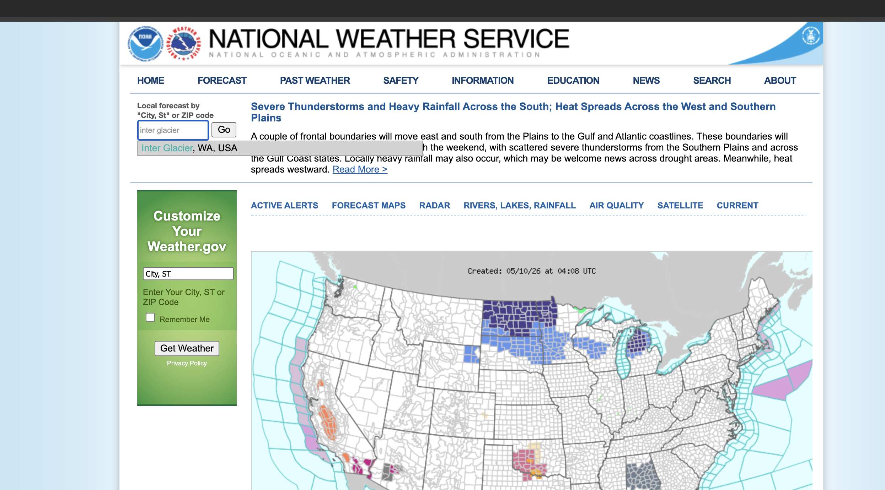

2. On the resulting details page, scroll down and click on **Hourly Weather Forecast** to enter the data page.

   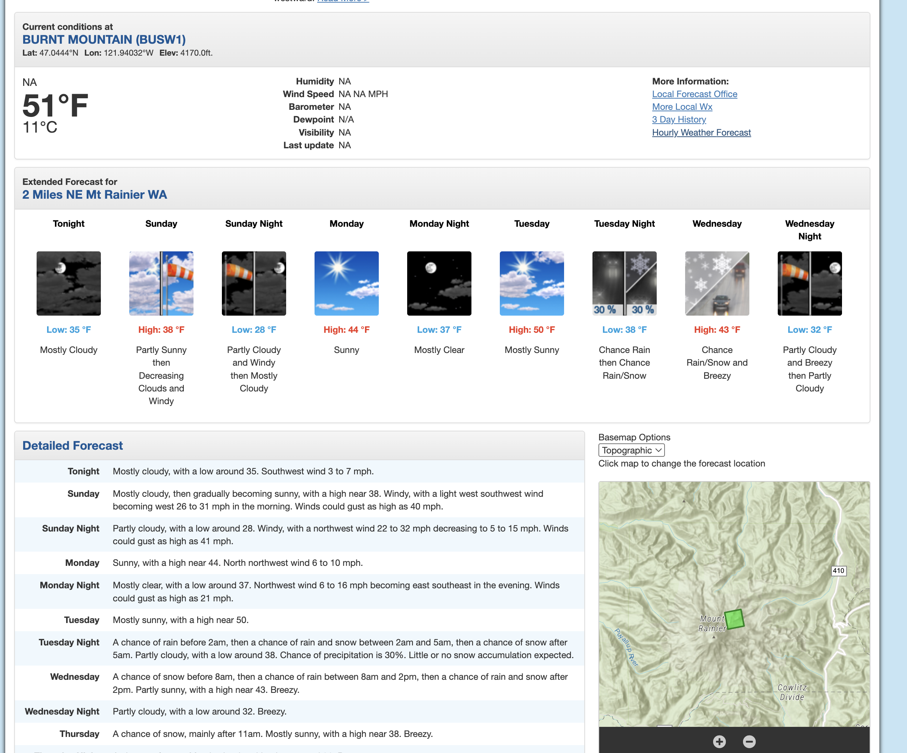

3. Once you are on the Hourly Weather Forecast data page, locate and click the orange **XML** button near the top right.

   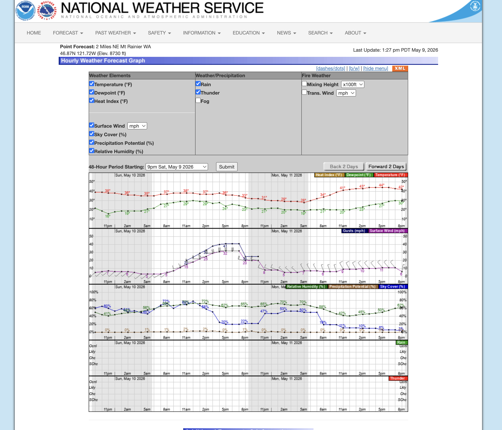

4. This opens the raw XML data view. Copy the URL directly from your browser's address bar.

   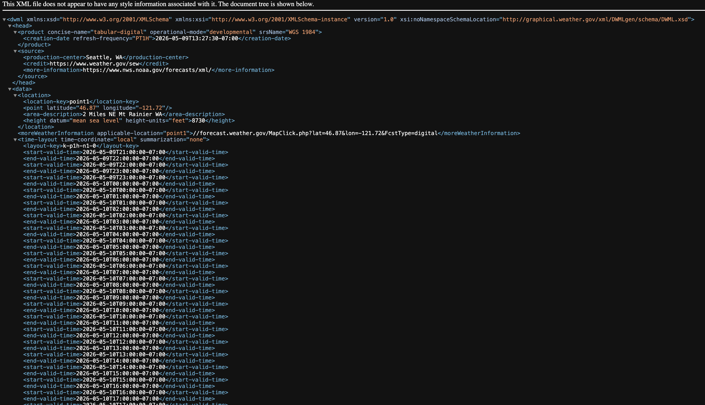

5. Open your terminal and use the `ullrs-secret import` command to fetch this raw data into a local JSON file:
   ```bash
   ullrs-secret import nws "<YOUR_COPIED_XML_URL>"
   ```

6. Before plotting, you need the vitals for your specific line. Tap into your past experience, dig through recent trip reports, or use mapping apps like onX Backcountry to pinpoint the exact elevation range, slope angle, and aspect of the face you want to ski.

7. Finally, feed those precise parameters into `ullrs-secret corn-plot` to generate your predictive analysis chart:
    ```bash
   ullrs-secret corn-plot --elevation 8730 --slope 35 --aspect 180 weather_data.json
    ```
Now, onto the daily emotional rollercoaster.

## Monday (5/4): Ambition is a Dangerous Thing

It’s Monday. The weekend is a distant dream, but hope springs eternal. I pulled up the charts for both Wy'East Face and Inter Glacier.


*Wy'East Face looking a bit demanding...*


*Inter Glacier keeping things slightly more civilized.*

From the graph analysis on Monday, the "corn window" (that magical time when the snow is just soft enough to edge, but not so soft you sink to your waist) for Wy'East Face ranged from **9:30 AM to 10:30 AM** on Saturday, and even earlier on Sunday. Meanwhile, Inter Glacier offered a more forgiving window of **11:30 AM to 1:00 PM** (again, slightly earlier on Sunday).

Here's the catch: Both routes pack a hefty 5,000 feet of elevation gain and demand a solid 5 to 6 hours of uphill slogging. Targeting the Wy'East Face corn window meant committing to a near alpine-start of 4:00 AM. I'm a skier, not a baker. Inter Glacier, with a start time around a more reasonable 6:00 AM, was already looking like the clear winner.

## Tuesday (5/5): Reality Check and New Contenders

On Tuesday, I decided to put my focus entirely on the more realistic Inter Glacier route. However, the skiing section of Inter Glacier is a long haul, ranging from a breezy 9,000+ feet down to a sweaty sub-7,000 feet. So, I ran the forecast for both the original elevation (8,730 ft) and the lower exit elevation (7,000 ft).

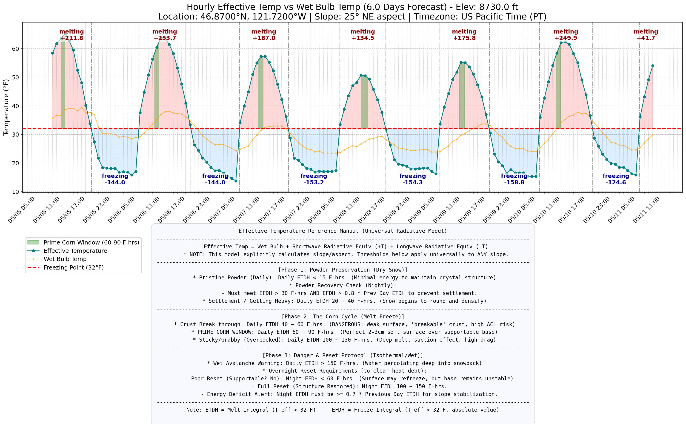
*Top of Inter Glacier: Looking decent.*

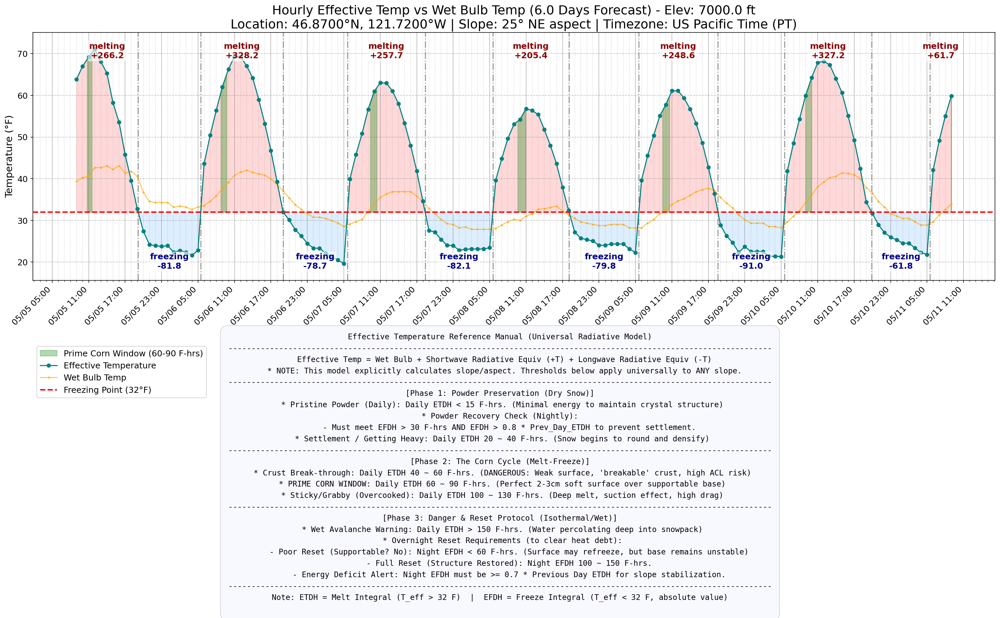
*Bottom of Inter Glacier: Uh oh, getting sticky.*

The forecast had shifted! Now, the weekend corn window at the top was around 11:00 AM to 12:00 PM, but down at 7,000 feet, it was 10:00 AM to 11:00 AM. This meant an even earlier start time and the grim inevitability of skiing sticky, knee-wrecking glop at lower elevations on the way out.

Realizing I was actually looking for a *chill* weekend vibe, I threw a wildcard into the mix: **Nisqually Chute** in the Rainier Paradise area. 

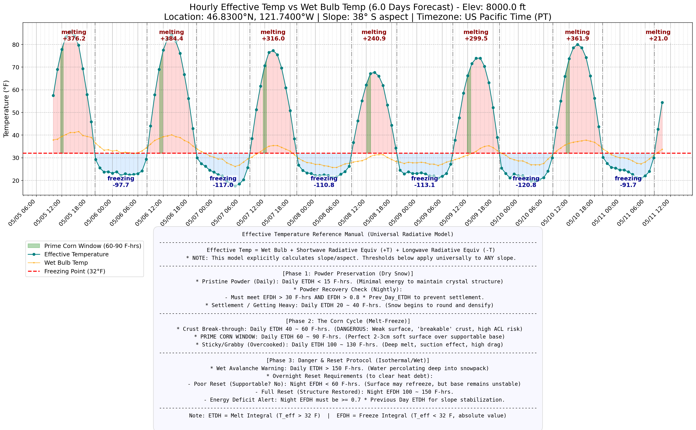
*Nisqually Chute entering the chat with a civilized schedule.*

The forecast for Nisqually showed a highly promising 12:00 PM to 1:00 PM corn window. Considering it's a much shorter route requiring only 3,000 feet of elevation gain, this was screaming "relaxing weekend."

Just for giggles, I took one last look at Wy'East Face at 10,000 feet.
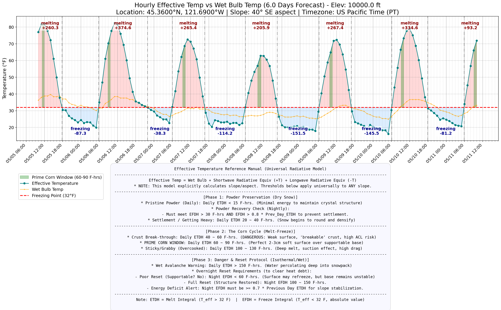
Even at the very top, "Corn O'Clock" was starting as early as 10:00 AM. An early, exhausting trip no matter how you sliced it. Wy'East was officially voted off the island.

## Wednesday (5/6): The Plot Thickens

Wednesday arrived, and the weather gods decided to shuffle the deck again.

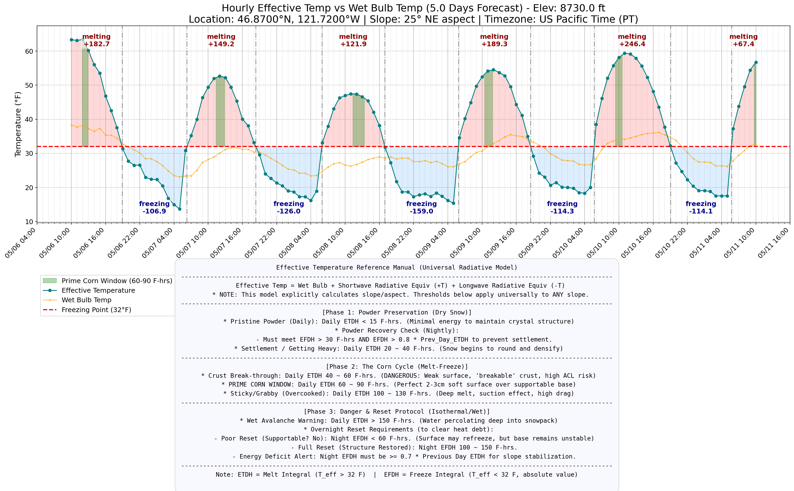
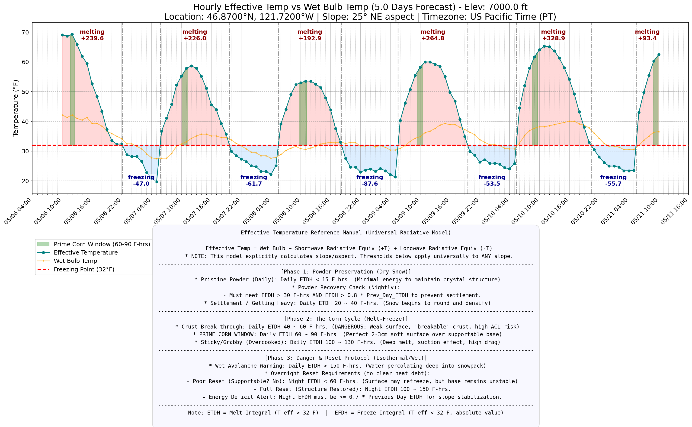

Inter Glacier now showed a corn window from 11:00 AM to almost 1:00 PM at the top. But down low at 7,000 feet? Sticky city right after 11:00 AM. 

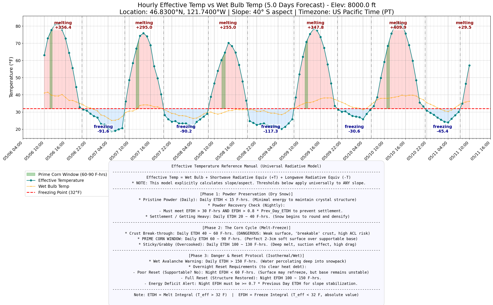

In contrast, Nisqually Chute held strong, still promising that sweet 12:00 PM to 1:00 PM window on the weekend. Let's do the math: a 2.5-hour drive plus a 3-hour uphill skin means I only needed to wake up at 6:00 AM. Honestly? Sounds like a spa day compared to Wy'East.

## Thursday (5/7): The Nail in the Coffin

By Thursday, the Inter Glacier forecast took a turn for the worse.

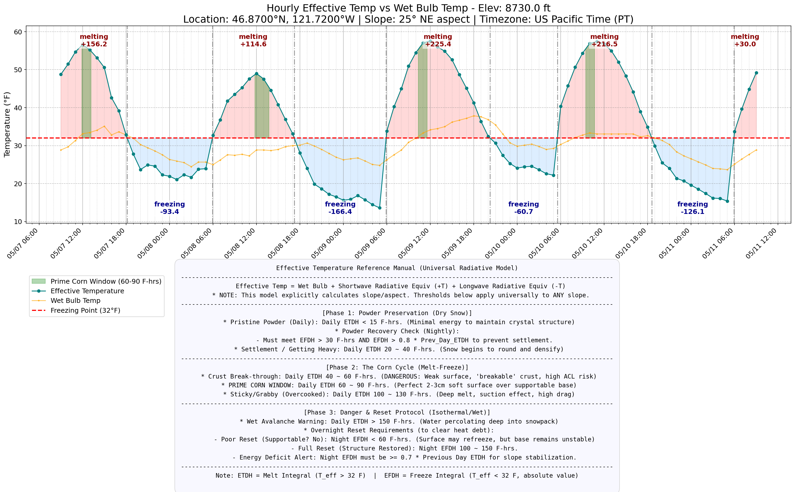
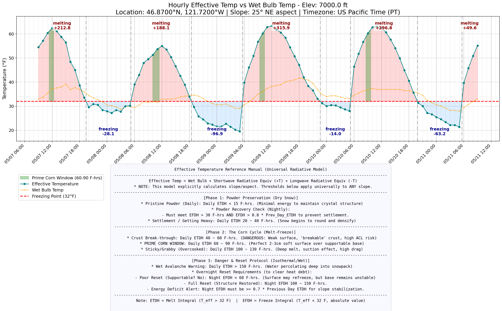

The corn window had shrunk to 10:00 AM to just before 12:00 PM, even above 8,000 feet. And the sticky snow down low was now practically a guarantee. It was turning into a sufferfest.

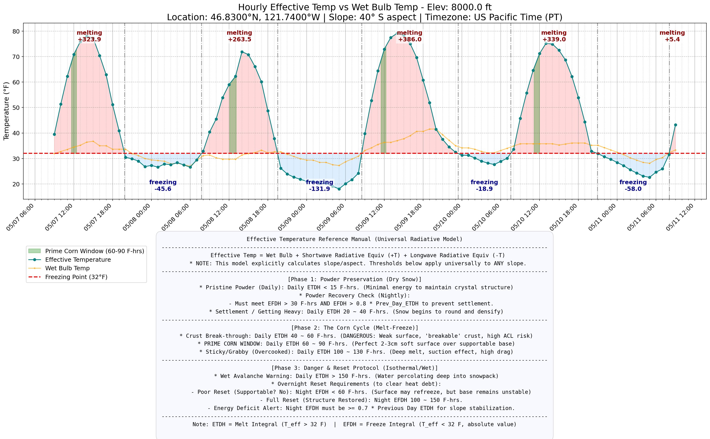
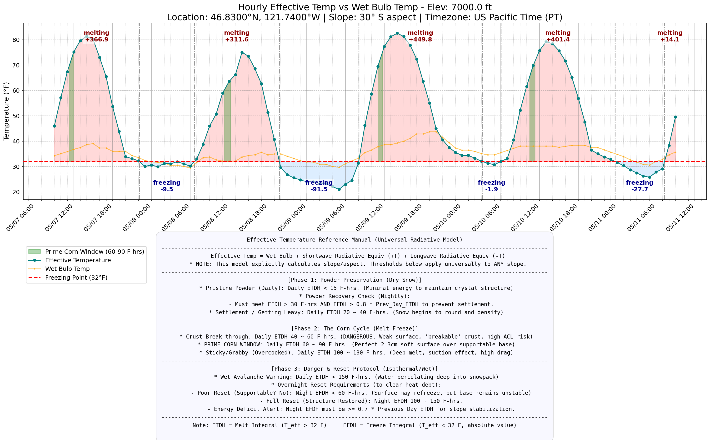

Nisqually Chute, meanwhile, was still holding steady at 12:00 PM to 1:00 PM up high. I checked the 7,000 ft elevation for Nisqually just to be safe. It showed the corn window closing right at 12:00 PM. Not perfect, but highly acceptable considering the short duration of the route. You win some, you lose some, but at least I get to sleep.

## Friday (5/8): Commitment Issues Resolved

It's Friday. Time to lock it in. I officially decided to hit Nisqually Chute on Saturday. 

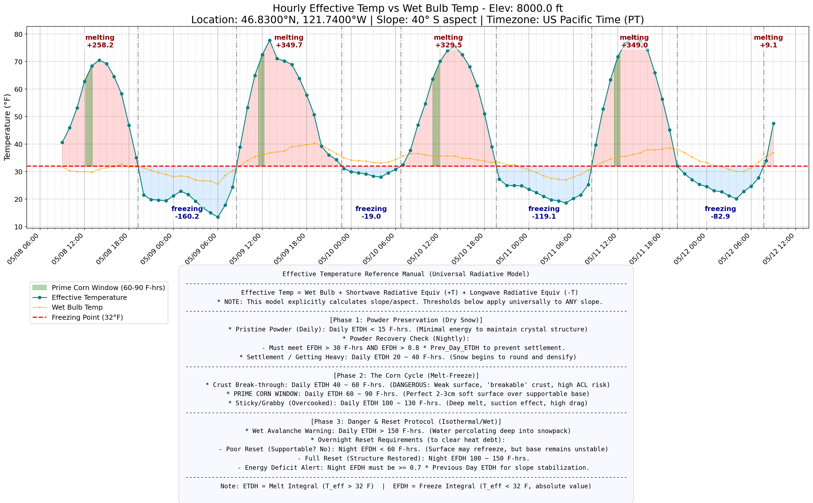
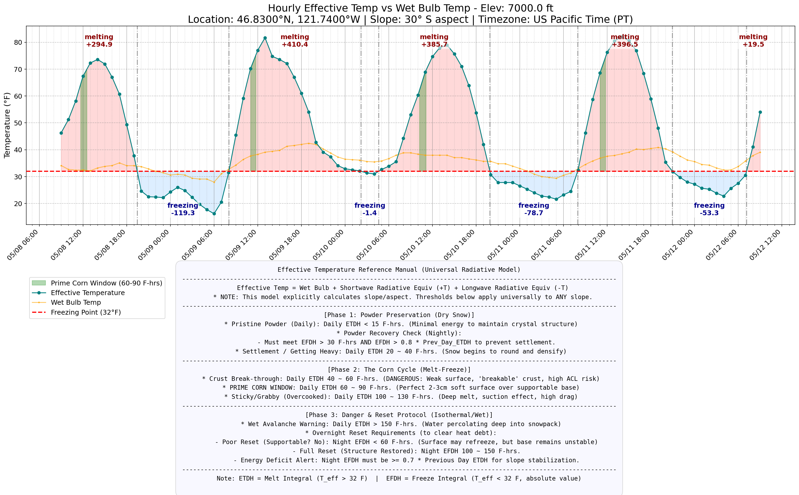

Taking one final look at the charts for tomorrow, the Nisqually corn window was sitting pretty between 11:00 AM and 12:00 PM. If I could transition and start skiing right at 11:30 AM, I was virtually guaranteed to ski glorious, hero-snow corn from top to bottom.

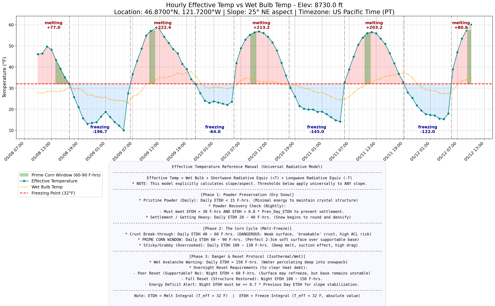

Just for old time's sake, I peeked at Inter Glacier. The new forecast showed an 11:00 AM to 12:00 PM window. Sure, it looked okay, but remember those extra 2,000 feet of elevation gain? Yeah, no thanks. 

I'm sticking to the relaxing plan. Nisqually Chute, here I come.
